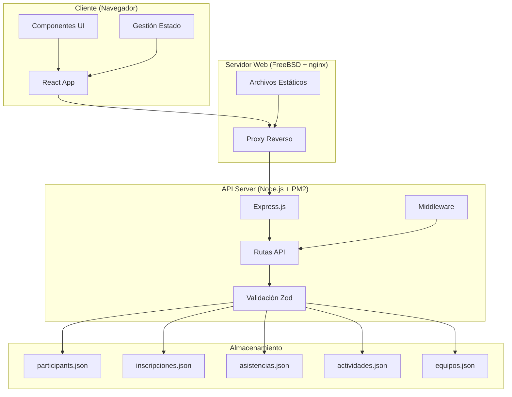
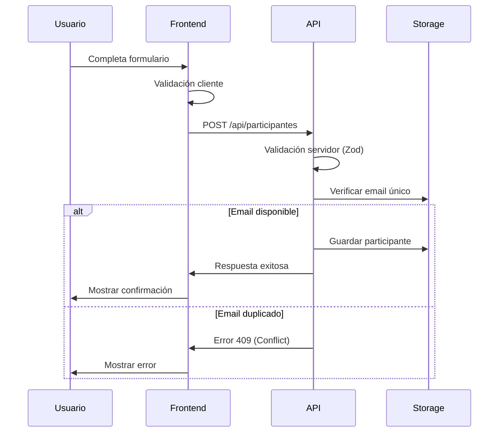
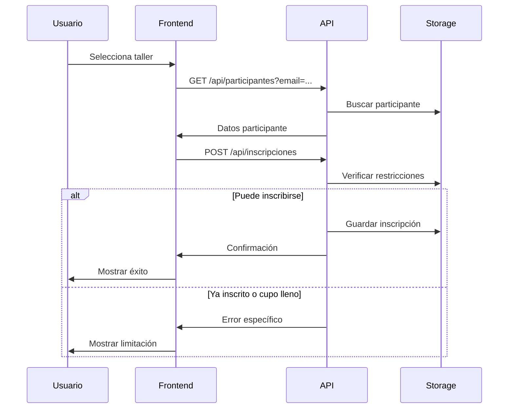

# Documentación Técnica - Sistema JII 2025

## Resumen Ejecutivo

El Sistema JII 2025 (Jornada de Ingeniería Industrial) es una aplicación web completa para la gestión de eventos académicos, desarrollada con una arquitectura moderna React + Node.js. El sistema permite el registro de participantes, inscripción a talleres, registro de asistencias, generación de constancias y gestión de concursos grupales.

## Arquitectura del Sistema

### Arquitectura General

El sistema JII 2025 implementa una **arquitectura cliente-servidor** con separación clara de responsabilidades:

$$\boxed{\text{Frontend (React + TypeScript)} \leftrightarrow \text{API REST} \leftrightarrow \text{Backend (Node.js + Express)} \leftrightarrow \text{Storage (JSON)}}$$

### Stack Tecnológico

| Capa | Tecnología | Versión | Propósito |
|------|------------|---------|-----------|
| **Frontend** | React | 19.1.1 | Interfaz de usuario reactiva |
| **Build Tool** | Vite | 7.1.2 | Empaquetado y desarrollo |
| **Styling** | Tailwind CSS | 3.4.17 | Estilos utilitarios |
| **Animations** | Framer Motion | 12.23.13 | Animaciones fluidas |
| **Forms** | React Hook Form | 7.62.0 | Gestión de formularios |
| **Validation** | Zod | 4.1.5 | Validación de esquemas |
| **Backend** | Node.js + Express | 5.1.0 | API REST server |
| **Language** | TypeScript | 5.8.3 | Tipado estático |
| **Process Management** | PM2 | - | Gestión de procesos |
| **Storage** | JSON Files | - | Persistencia de datos |

### Diagrama de Arquitectura



## Estructura del Proyecto

### Frontend (`/src`)

```
src/
├── 📄 main.tsx                 # Punto de entrada
├── 📄 App.tsx                  # Componente raíz + Router
├── 🎨 App.css, index.css       # Estilos globales
├── 📁 components/              # Componentes reutilizables
│   ├── 📁 animations/          # Componentes animados
│   │   ├── AnimatedButtons.tsx
│   │   ├── AnimatedContainers.tsx
│   │   ├── AnimatedSVG.tsx
│   │   ├── AnimatedText.tsx
│   │   └── ScrollAnimations.tsx
│   ├── 📁 forms/               # Formularios principales
│   │   ├── registro.tsx        # 👤 Registro participantes
│   │   ├── workshop.tsx        # 🎓 Inscripción talleres
│   │   ├── asistencia.tsx      # ✅ Registro asistencias
│   │   ├── constancias.tsx     # 📜 Generación constancias
│   │   └── registro_concurso.tsx # 🏆 Registro equipos
│   ├── 📁 navbar/              # Navegación
│   └── 📁 footer/              # Pie de página
├── 📁 pages/                   # Páginas principales
│   ├── home.tsx                # 🏠 Página inicio
│   ├── 📁 actividades/         # 📅 Conferencias y talleres
│   ├── 📁 historia/            # 📖 Historia del evento
│   ├── 📁 concurso/            # 🎯 Rally de conocimientos
│   ├── 📁 registro/            # 📝 Hub de registros
│   ├── 📁 staff/               # 👥 Equipo organizador
│   └── 📁 aliados/             # 🤝 Patrocinadores
└── 📁 public/assets/images/    # Recursos multimedia
```

### Backend (`/server` y `/api-server.js`)

```
server/                         # Versión TypeScript (desarrollo)
├── 📄 package.json
├── 📄 tsconfig.json
├── 📁 src/
│   ├── 📄 server.ts            # Servidor principal
│   ├── 📁 routes/              # Rutas API organizadas
│   │   ├── participantes.ts    # CRUD participantes
│   │   ├── actividades.ts      # Gestión actividades
│   │   ├── asistencias.ts      # Control asistencias
│   │   ├── workshops.ts        # Inscripciones talleres
│   │   ├── equipos.ts          # Gestión equipos concurso
│   │   └── constancias.ts      # Generación documentos
│   ├── 📁 schemas/             # Validación Zod
│   │   ├── participantes.ts
│   │   ├── asistencias.ts
│   │   ├── equipos.ts
│   │   └── workshops.ts
│   ├── 📁 middleware/          # Middleware personalizado
│   │   ├── cors.ts
│   │   ├── errors.ts
│   │   └── rateLimit.ts
│   └── 📁 utils/               # Utilidades
│       ├── reply.ts
│       └── tz.ts

📄 api-server.js               # Versión producción (ES modules)
```

## Modelo de Datos

### Esquema de Participantes

```typescript
interface Participante {
  id: number;                    // ID único autogenerado
  apellidoPaterno: string;       // Apellido paterno (obligatorio)
  apellidoMaterno: string;       // Apellido materno (obligatorio)  
  primerNombre: string;          // Primer nombre (obligatorio)
  segundoNombre?: string;        // Segundo nombre (opcional)
  email: string;                 // Email único (obligatorio)
  telefono: string;              // Teléfono 10 dígitos (obligatorio)
  categoria: Categoria;          // Tipo de participante
  programa?: Programa;           // Solo para estudiantes
  brazalete?: number;            // Número asignado para acceso
  fechaRegistro: Date;           // Timestamp de registro
}
```

### Taxonomía de Categorías

$$\text{Categorías} = \begin{cases}
\text{Estudiante de Ingeniería Industrial} & \rightarrow \text{Backend: "Estudiante" + "Ingeniería Industrial"} \\
\text{Estudiante Invitado} & \rightarrow \text{Backend: "Estudiante" + \text{programa seleccionado}} \\
\text{Docente} & \rightarrow \text{Backend: "Docente" (sin programa)} \\
\text{Ponente} & \rightarrow \text{Backend: "Ponente" (sin programa)} \\
\text{Asistente Externo} & \rightarrow \text{Backend: "Asistente externo" (sin programa)}
\end{cases}$$

### Programas Académicos Disponibles

```typescript
type Programa = 
  | "Ingeniería Industrial"
  | "Ingeniería Ambiental"  
  | "Ingeniería en Datos e Inteligencia Organizacional"
  | "Ingeniería en Logística y Cadena de Suministro"
  | "Ingeniería en Inteligencia Artificial"
  | "Ingeniería en Industrias Alimentarias";
```

### Esquema de Actividades

```typescript
interface Actividad {
  id: number;                    // ID único
  titulo: string;                // Nombre de la actividad
  descripcion?: string;          // Descripción detallada
  tipo: TipoActividad;           // Clasificación
  ponente?: string;              // Facilitador/speaker
  fecha: Date;                   // Fecha programada
  lugar?: string;                // Ubicación física
  cupoMaximo?: number;           // Límite de participantes
  requiereInscripcion: boolean;  // Si necesita registro previo
}

type TipoActividad = "conference" | "workshop" | "forum";
```

### Esquema de Equipos (Concurso)

```typescript
interface Equipo {
  id: number;                    // ID único autogenerado
  nombreEquipo: string;          // Nombre único del equipo
  emailCapitan: string;          // Email del líder
  emailsMiembros: string[5];     // Exactamente 5 miembros adicionales
  fechaRegistro: Date;           // Timestamp de registro
  activo: boolean;               // Estado del equipo
}
```

**Restricciones del Concurso:**
- ✅ Equipos de exactamente **6 integrantes** (1 capitán + 5 miembros)
- ✅ Solo participantes **previamente registrados** en el sistema
- ✅ **Una persona = un equipo** (no se permite participar en múltiples equipos)
- ✅ Nombres de equipos **únicos** en todo el sistema

## API Reference

### Endpoints de Participantes

#### `POST /api/participantes`
**Registrar nuevo participante**

```json
{
  "apellidoPaterno": "string",
  "apellidoMaterno": "string", 
  "primerNombre": "string",
  "segundoNombre": "string?",
  "email": "string (unique)",
  "telefono": "string (10 digits)",
  "categoria": "Estudiante de Ingeniería Industrial" | "Estudiante Invitado" | "Docente" | "Ponente" | "Asistente Externo",
  "programa": "string?" // Solo si categoria incluye "Estudiante"
}
```

**Respuesta exitosa (201):**
```json
{
  "success": true,
  "data": {
    "id": 123,
    "email": "usuario@example.com",
    "categoria": "Estudiante",
    "programa": "Ingeniería Industrial",
    "fechaRegistro": "2025-09-19T10:30:00.000Z"
  }
}
```

#### `GET /api/participantes?email={email}`
**Buscar participante por email**

**Respuesta exitosa (200):**
```json
{
  "success": true,
  "data": {
    "id": 123,
    "primerNombre": "Juan",
    "apellidoPaterno": "Pérez",
    "email": "juan.perez@email.com",
    "categoria": "Estudiante",
    "programa": "Ingeniería Industrial"
  }
}
```

#### `GET /api/participantes/check-email?email={email}`
**Verificar disponibilidad de email**

**Respuesta (200):**
```json
{
  "available": false,
  "message": "Este correo ya fue registrado"
}
```

### Endpoints de Actividades

#### `GET /api/actividades?tipo={tipo}&inscripcion={boolean}`
**Listar actividades con filtros opcionales**

**Parámetros de consulta:**
- `tipo`: `"conference" | "workshop" | "forum"`
- `inscripcion`: `"true" | "false"` (requiere registro previo)

**Respuesta exitosa (200):**
```json
{
  "success": true,
  "data": [
    {
      "id": 1,
      "titulo": "Workshop de Lean Manufacturing",
      "descripcion": "Metodologías de manufactura esbelta",
      "tipo": "workshop",
      "ponente": "Dr. Ana García",
      "fecha": "2025-09-20T14:00:00.000Z",
      "lugar": "Aula 301",
      "cupoMaximo": 30,
      "requiereInscripcion": true,
      "inscritosActuales": 15
    }
  ]
}
```

### Endpoints de Inscripciones (Talleres)

#### `POST /api/inscripciones`
**Inscribirse a un taller**

```json
{
  "email": "participante@email.com",
  "actividadId": 1
}
```

**Restricciones:**
- ✅ Solo **un taller por participante**
- ✅ Participante debe estar **previamente registrado**
- ✅ Taller debe **requerir inscripción**
- ✅ No exceder **cupo máximo**

### Endpoints de Asistencias

#### `POST /api/asistencias`
**Registrar asistencia a actividad**

```json
{
  "email": "participante@email.com",
  "actividadId": 1
}
```

#### `GET /api/asistencias?email={email}`
**Consultar asistencias de participante**

### Endpoints de Equipos (Concurso)

#### `POST /api/equipos`
**Registrar equipo para concurso**

```json
{
  "nombreEquipo": "Los Ingenieros",
  "emailCapitan": "capitan@email.com", 
  "emailsMiembros": [
    "miembro1@email.com",
    "miembro2@email.com", 
    "miembro3@email.com",
    "miembro4@email.com",
    "miembro5@email.com"
  ]
}
```

#### `GET /api/equipos/check-name?nombre={nombre}`
**Verificar disponibilidad de nombre de equipo**

#### `GET /api/equipos/check-participant?email={email}`
**Verificar elegibilidad de participante**

### Endpoints de Constancias

#### `GET /api/constancias/general?email={email}`
**Generar constancia de participación**

**Requisitos para constancia:**
- ✅ Asistencia a **mínimo 2 actividades** de tipo conferencia, foro o workshop
- ✅ Participante registrado en el sistema

## Validación y Seguridad

### Validación del Frontend

```typescript
// Validación teléfono con expresión regular
const phoneValidation = /^\d{10}$/;

// Validación email con regex estándar
const emailValidation = /^[^\s@]+@[^\s@]+\.[^\s@]{2,}$/i;

// Esquema de validación con Zod
const participanteSchema = z.object({
  apellidoPaterno: z.string().min(1, "Campo obligatorio"),
  apellidoMaterno: z.string().min(1, "Campo obligatorio"),
  primerNombre: z.string().min(1, "Campo obligatorio"),
  segundoNombre: z.string().optional(),
  email: z.string().email("Email inválido"),
  telefono: z.string().regex(/^\d{10}$/, "Deben ser 10 dígitos"),
  categoria: z.enum(["Estudiante", "Docente", "Ponente", "Asistente externo"]),
  programa: z.string().optional()
}).refine((data) => {
  // Programa obligatorio solo para estudiantes
  return data.categoria !== "Estudiante" || !!data.programa;
}, {
  message: "Selecciona un programa",
  path: ["programa"]
});
```

### Middleware de Seguridad

```javascript
// CORS configurado para dominios específicos
const corsOptions = {
  origin: ['http://192.168.200.212', 'http://localhost:5173', 'http://localhost:3000'],
  credentials: true,
  methods: ['GET', 'POST', 'PUT', 'DELETE', 'OPTIONS'],
  allowedHeaders: ['Content-Type', 'Authorization', 'X-Requested-With']
};

// Rate limiting para prevenir abuso
app.use('/api/', rateLimit({
  windowMs: 15 * 60 * 1000, // 15 minutos
  max: 100 // máximo 100 requests por IP
}));

// Validación de entrada en todas las rutas
app.use('/api/participantes', (req, res, next) => {
  const validation = participanteSchema.safeParse(req.body);
  if (!validation.success) {
    return res.status(422).json({
      error: "Datos inválidos",
      details: validation.error.issues
    });
  }
  next();
});
```

## Flujo de Datos

### Flujo de Registro de Participante



### Flujo de Inscripción a Taller



## Configuración de Desarrollo

### Configuración Local

```bash
# Instalar dependencias
npm install

# Desarrollo con hot reload
npm run dev  # Inicia frontend (Vite) + backend concurrentemente

# Solo frontend
npm run dev:frontend

# Solo backend  
cd server && npm run dev
```

### Variables de Entorno

```bash
# .env (desarrollo)
VITE_API_BASE_URL=http://localhost:3001/api
VITE_DEPLOY_TARGET=local

# .env.production
VITE_API_BASE_URL=/api
VITE_DEPLOY_TARGET=server
```

### Configuración de Build

```json
{
  "scripts": {
    "build": "npm run build:frontend && npm --prefix server run build",
    "build:frontend": "vite build",
    "build:gh-pages": "vite build --mode production"
  }
}
```

## Configuración de Producción

### Servidor FreeBSD + nginx

```nginx
# nginx.conf
server {
    listen 80;
    listen 443 ssl;
    server_name jii2025.unicaribe.mx;
    
    root /usr/local/www/jii2025.unicaribe.mx;
    index index.html;
    
    # Archivos estáticos (Frontend)
    location / {
        try_files $uri $uri/ /index.html;
    }
    
    # API (Backend)
    location /api/ {
        proxy_pass http://localhost:3001;
        proxy_http_version 1.1;
        proxy_set_header Upgrade $http_upgrade;
        proxy_set_header Connection 'upgrade';
        proxy_set_header Host $host;
        proxy_set_header X-Real-IP $remote_addr;
        proxy_set_header X-Forwarded-For $proxy_add_x_forwarded_for;
        proxy_set_header X-Forwarded-Proto $scheme;
        proxy_cache_bypass $http_upgrade;
    }
}
```

### PM2 Configuration

```bash
# Iniciar API en producción
pm2 start server.js --name "jii2025-api"

# Configuración persistente
pm2 startup
pm2 save

# Monitoreo
pm2 monit
pm2 logs jii2025-api
```

## Patrones de Diseño Implementados

### 1. **Repository Pattern** (Simulado)
```javascript
// Abstracción para acceso a datos JSON
class JsonRepository {
  constructor(filePath) {
    this.filePath = filePath;
  }
  
  findAll() { /* implementación */ }
  findById(id) { /* implementación */ }
  create(data) { /* implementación */ }
  update(id, data) { /* implementación */ }
}
```

### 2. **Strategy Pattern** (Validación)
```typescript
// Diferentes estrategias de validación según el tipo
interface ValidationStrategy {
  validate(data: unknown): ValidationResult;
}

class ParticipanteValidation implements ValidationStrategy {
  validate(data: unknown) {
    return participanteSchema.safeParse(data);
  }
}
```

### 3. **Observer Pattern** (React State)
```typescript
// React hooks como implementación de observer
const [participantes, setParticipantes] = useState<Participante[]>([]);

// Los componentes se re-renderizan automáticamente al cambiar el estado
useEffect(() => {
  fetchParticipantes().then(setParticipantes);
}, []);
```

### 4. **Factory Pattern** (Respuestas API)
```javascript
// Generador estandarizado de respuestas
const ResponseFactory = {
  success: (data, message = 'Operación exitosa') => ({
    success: true,
    data,
    message
  }),
  
  error: (message, code = 'GENERIC_ERROR', field = null) => ({
    success: false,
    error: message,
    code,
    field
  })
};
```

## Análisis de Rendimiento

### Métricas de Bundle Size

```bash
# Análisis del bundle de producción
npm run build

# Salida esperada:
# dist/assets/index-[hash].js     ~245.67 kB │ gzip: ~78.23 kB
# dist/assets/index-[hash].css    ~12.45 kB  │ gzip: ~3.67 kB
```

### Optimizaciones Implementadas

1. **Code Splitting**: Lazy loading de rutas con `React.lazy()`
2. **Tree Shaking**: Eliminación de código no utilizado
3. **Asset Optimization**: Compresión de imágenes y minificación
4. **CDN Ready**: Assets con hash para cache busting

### Carga y Tiempos de Respuesta

| Métrica | Valor Objetivo | Implementación |
|---------|---------------|----------------|
| **First Contentful Paint** | < 1.5s | Vite optimizations |
| **Largest Contentful Paint** | < 2.5s | Image optimization |
| **API Response Time** | < 200ms | Efficient JSON operations |
| **Bundle Size** | < 300kB | Tree shaking + minification |

## Testing y Calidad

### Estrategia de Testing

```typescript
// Pruebas unitarias con Jest/Vitest (recomendado)
describe('ParticipanteValidation', () => {
  test('should validate correct participant data', () => {
    const validData = {
      apellidoPaterno: 'Pérez',
      apellidoMaterno: 'García', 
      primerNombre: 'Juan',
      email: 'juan@email.com',
      telefono: '9988776655',
      categoria: 'Estudiante',
      programa: 'Ingeniería Industrial'
    };
    
    const result = participanteSchema.safeParse(validData);
    expect(result.success).toBe(true);
  });
});
```

### Linting y Formateo

```json
{
  "eslint": "^9.33.0",
  "typescript-eslint": "^8.39.1",
  "prettier": "^3.0.0"
}
```

## Monitoreo y Logs

### Logging Estructurado

```javascript
// Middleware de logging detallado
app.use((req, res, next) => {
  console.log('\n=== Nueva solicitud ===');
  console.log('Método:', req.method);
  console.log('URL:', req.url);
  console.log('Headers:', JSON.stringify(req.headers, null, 2));
  console.log('Body:', req.body);
  console.log('Timestamp:', new Date().toISOString());
  next();
});
```

### Health Checks

```javascript
// Endpoint de salud del sistema
app.get('/api/health', (req, res) => {
  res.json({
    status: 'OK',
    timestamp: new Date().toISOString(),
    uptime: process.uptime(),
    version: process.env.npm_package_version || '1.0.0',
    environment: process.env.NODE_ENV || 'development'
  });
});
```

## Escalabilidad y Futuras Mejoras

### Roadmap Técnico

1. **Base de Datos Relacional**
   - Migración de JSON a PostgreSQL/MySQL
   - Implementación de transacciones ACID
   - Índices optimizados para consultas frecuentes

2. **Autenticación y Autorización**
   - JWT tokens para sesiones
   - Roles y permisos granulares
   - OAuth2 integration

3. **Caching Layer**
   - Redis para cache de sesiones
   - CDN para assets estáticos
   - Application-level caching

4. **Real-time Features**
   - WebSockets para actualizaciones en vivo
   - Notificaciones push
   - Live dashboard de métricas

### Consideraciones de Escalabilidad

$$\text{Capacidad Estimada} = \begin{cases}
\text{Participantes} & \leq 1000 \text{ (configuración actual)} \\
\text{Requests/minuto} & \leq 500 \text{ (con rate limiting)} \\
\text{Concurrencia} & \leq 50 \text{ usuarios simultáneos} \\
\text{Storage} & \sim 10MB \text{ (datos JSON)}
\end{cases}$$

## Troubleshooting

### Problemas Comunes

#### 1. "Ruta no encontrada" al registrarse
**Causa**: Mismatch entre rutas frontend/backend
**Solución**: Verificar configuración CORS y proxy

#### 2. Validación de teléfono falla
**Causa**: Campo telefono cambió de opcional a obligatorio  
**Solución**: Actualizar schema y frontend validation

#### 3. PM2 process crashed
**Causa**: Error no manejado en Express
**Solución**: `pm2 restart jii2025-api && pm2 logs`

### Comandos de Diagnóstico

```bash
# Verificar estado del backend
pm2 status
pm2 logs jii2025-api --lines 50

# Test de conectividad API
curl -X GET "http://localhost:3001/api/health"

# Verificar estructura de archivos JSON
ls -la *.json
jq . participants.json | head -20

# Análisis de bundle
npm run build -- --analyze
```

## Contribución

### Git Workflow

```bash
# Flujo de desarrollo
git checkout -b feature/nueva-funcionalidad
git add . && git commit -m "feat: descripción clara"
git push origin feature/nueva-funcionalidad

# Merge a main después de code review
git checkout main
git merge feature/nueva-funcionalidad
git push origin main
```

### Convenciones de Código

1. **Naming Conventions**:
   - Componentes: `PascalCase` (`RegistroComponent`)
   - Variables/functions: `camelCase` (`handleSubmit`)
   - Constants: `UPPER_SNAKE_CASE` (`API_BASE_URL`)

2. **File Organization**:
   - Un componente por archivo
   - Index files para exports agrupados
   - Colocación de assets en carpetas temáticas

3. **TypeScript Usage**:
   - Interfaces explícitas para props
   - Union types para enums
   - Strict mode habilitado

---

**Documento generado**: Septiembre 19, 2025  
**Versión del sistema**: JII 2025 v1.0.0  
**Autor**: Sistema de documentación automática  
**Última actualización**: API endpoints y validaciones implementadas

---
