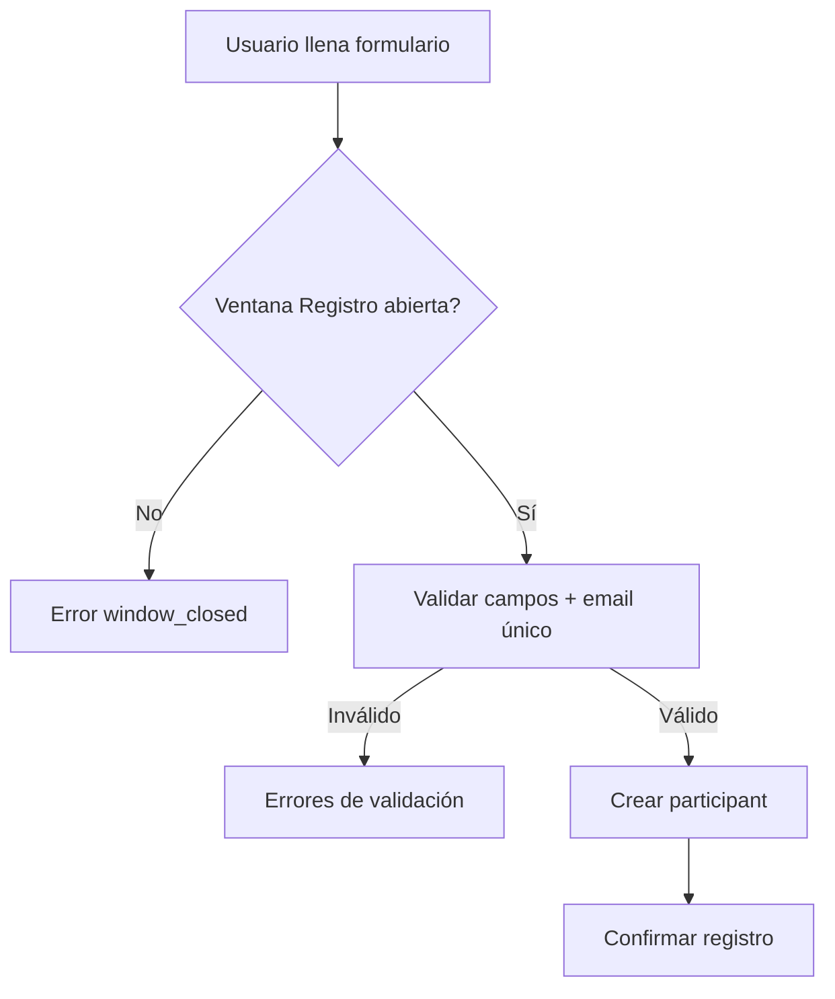
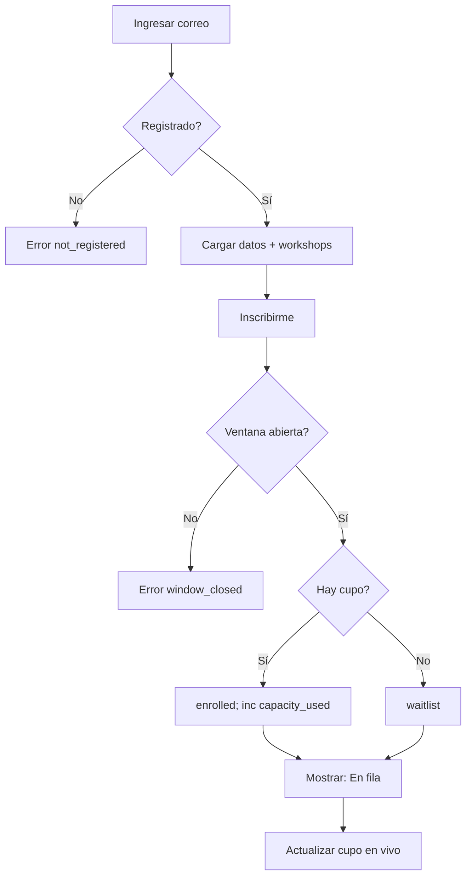
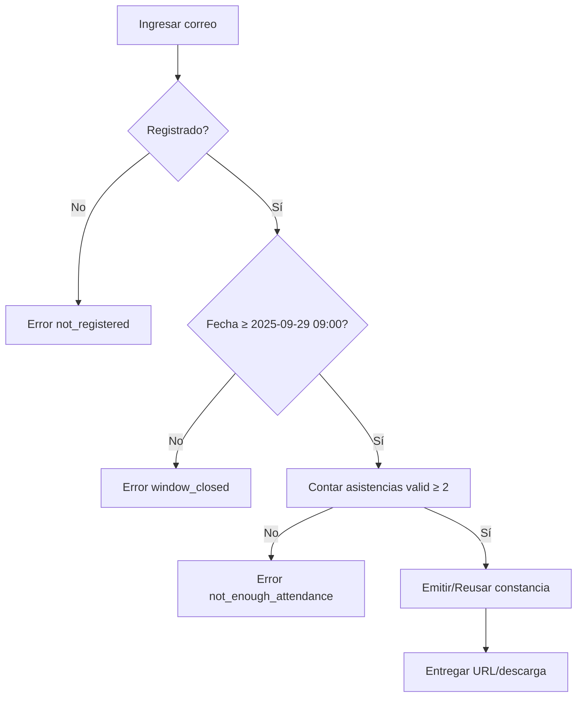

# Especificación de Flujo — JII2025 (Registro, Workshops, Asistencia, Constancias y Concurso)

> **Zona horaria oficial:** America/Cancun (UTC-5, sin DST)  
> Todas las validaciones de ventana de tiempo deben evaluarse en esa zona.

## 1) Alcance y reglas de negocio

- **Participante**: persona registrada con: apellido paterno, apellido materno, primer nombre, *segundo nombre (opcional)*, correo, teléfono y **categoría** (catálogo).
- **Workshop**: cada participante **solo puede** estar **inscrito** en **1** workshop **o** estar en **fila de espera** de **1** workshop (no ambos ni más de uno).
- **Asistencia**: requiere **brazalete** registrado. Se marca en la **ventana**: **–15 min a +15 min** desde el inicio de cada actividad.
- **Constancia**: requiere **≥ 2 asistencias válidas**.
- **Cupos**: visibles en frontend y **actualizados en tiempo real** (WebSocket/SSE o *polling* cada 5–10 s).
- **Idempotencia**: inscripciones y asistencias deben ser idempotentes (reintentos seguros).

## 2) Ventanas de tiempo (fechas exactas)

- **Registro**: 22-sep-2025 **09:00** → 26-sep-2025 **23:59**
- **Workshops**: 22-sep-2025 **09:00** → 23-sep-2025 **23:59**
- **Asistencias**: por actividad, **inicio−15 min** → **inicio+15 min**
- **Constancias**: desde 29-sep-2025 **09:00** (sin cierre)
- **Concurso**: 22-sep-2025 **09:00** → 23-sep-2025 **23:59**

> Si una ventana está **cerrada**, el backend debe responder 403/422 con código `window_closed`.

## 3) Modelos de datos mínimos (sugeridos)

**participants**  
- `id (PK)`, `email (UNIQUE, normalizado)`, `ap_paterno`, `ap_materno`, `nombre`, `segundo_nombre (nullable)`  
- `telefono (nullable)`, `categoria (ENUM o FK catálogo)`  
- `bracelet_code (UNIQUE, nullable)` — se llena al registrar brazalete

**workshops**  
- `id (PK)`, `titulo`, `descripcion`, `start_at (tz-aware)`, `end_at (tz-aware)`  
- `capacity_total`, `capacity_used`, `status ('draft|open|closed|archived')`

**enrollments**  
- `id (PK)`, `participant_id (FK)`, `workshop_id (FK)`  
- `state ('enrolled|waitlist|cancelled|completed')`, `created_at`  
- `UNIQUE (participant_id)` ← **1 workshop por persona** (inscrito o en fila)

**activities** *(conferencias/foros y workshops)*  
- `id (PK)`, `tipo ('conferencia|foro|workshop')`, `title`, `start_at`, `end_at`, `location`

**attendance**  
- `id (PK)`, `participant_id (FK)`, `activity_id (FK)`, `marked_at`  
- `status ('valid|out_of_window|rejected|duplicated')`  
- `UNIQUE (participant_id, activity_id, status='valid')`

**certificates**  
- `id (PK)`, `participant_id (FK)`, `issued_at`, `code (UNIQUE)`, `url`, `status ('issued|revoked')`

## 4) Validaciones clave

### Registro
- Email válido y **único**; categoría ∈ catálogo; ventana **Registro** abierta.

### Inscripción a workshop
- Ventana **Workshops** abierta; participante **registrado**.  
- Si ya tiene `enrollments.state in ('enrolled','waitlist')` → error `already_enlisted`.  
- Si `capacity_used < capacity_total` → `enrolled` y `capacity_used += 1`; si no → `waitlist` (sin tocar `capacity_used`).

### Asistencia
- Participante **registrado** y con **brazalete** (`bracelet_code` no nulo).  
- **Ventana** abierta para la actividad.  
- Actividades visibles: **todas** las conferencias/foros **y** **únicamente** el workshop del que esté `enrolled` **o** `waitlist`.  
- **Idempotente**: doble intento no duplica.

### Constancias
- Participante **registrado**.  
- Ventana **Constancias** abierta (≥ 29-sep-2025 09:00).  
- **Asistencias `status='valid'` ≥ 2** → emitir/retornar constancia **idempotente**.

## 5) Flujos (alto nivel)

### 5.1 Registro


### 5.2 Workshops


**Promoción automática de fila → inscrito**  
- *Trigger*: liberación de cupo (cancelación/cambio de capacidad).  
- *Algoritmo*: tomar **primer `waitlist` por `created_at`**, promover a `enrolled`, `capacity_used += 1`, notificar.

### 5.3 Asistencia
```mermaid
flowchart TD
A[Ingresar correo] --> B{Registrado?}
B -- No --> X[Error not_registered]
B -- Sí --> C[Mostrar datos + actividades visibles]
C --> D{Tiene brazalete?}
D -- No --> E[Capturar bracelet_code]
D -- Sí --> F[Elegir actividad]
E --> F
F --> G{Ahora ∈ [start-15m, start+15m]?}
G -- No --> Y[Error out_of_window]
G -- Sí --> H[Marcar asistencia idempotente]
H --> I[OK y guardar]
```

### 5.4 Constancias


## 6) API (sugerencia REST)

- `POST /participants` — **Registro**  
  **Body**: `{ ap_paterno, ap_materno, nombre, segundo_nombre?, email, telefono?, categoria }`  
  **Errores**: `window_closed`, `email_exists`, `validation_error`

- `GET /participants/{email}` — datos de participante

- `GET /workshops?visible=true` — lista con `capacity_total`, `capacity_used`, `state`

- `POST /workshops/{id}/enroll` — **Inscripción**  
  **Body**: `{ email }`  
  **Errores**: `not_registered`, `window_closed`, `already_enlisted`, `sold_out → waitlist_created`

- `GET /activities?scope=visible&email={email}` — **Actividades visibles**

- `POST /participants/{email}/bracelet` — registrar brazalete  
  **Body**: `{ bracelet_code }`  
  **Errores**: `bracelet_in_use`, `validation_error`

- `POST /attendance/mark` — **Marcar asistencia**  
  **Body**: `{ email, activity_id }`  
  **Errores**: `not_registered`, `no_bracelet`, `out_of_window`, `duplicate`

- `POST /certificates/issue` — **Emitir constancia**  
  **Body**: `{ email }`  
  **Errores**: `window_closed`, `not_enough_attendance`  
  **OK**: `{ code, url, issued_at }` (idempotente)

**Notas**: fechas **tz-aware** en `America/Cancun`. Para QA, permitir cabecera `X-Now-Override` (solo no-prod).

## 7) Lógica de ventanas (pseudocódigo)

```ts
function isWithinWindow(now, start, end) {
  return now >= start && now <= end;
}

// Registro
if (!isWithinWindow(now, "2025-09-22T09:00-05:00", "2025-09-26T23:59-05:00")) throw WindowClosed;

// Workshops
if (!isWithinWindow(now, "2025-09-22T09:00-05:00", "2025-09-23T23:59-05:00")) throw WindowClosed;

// Asistencias (por actividad)
const open = addMinutes(activity.start_at, -15);
const close = addMinutes(activity.start_at, +15);
if (!isWithinWindow(now, open, close)) throw OutOfWindow;

// Constancias
if (now < "2025-09-29T09:00-05:00") throw WindowClosed;
```

## 8) Concurrencia e idempotencia

- **Transacciones** en inscripción:
  1. `SELECT capacity_used, capacity_total FOR UPDATE`
  2. Si hay cupo → insertar `enrolled` y `capacity_used += 1`
  3. Si no → insertar `waitlist`
- **Promoción de fila**: job transaccional FIFO por `created_at`.
- **Idempotencia**: usar header **`Idempotency-Key`** y restricciones `UNIQUE` (ver attendance).

## 9) UX / Frontend

- **Cupo**: mostrar `usados/total` + estado **Inscrito**/**En fila** (posición opcional).  
- **Ventanas**: “**Abre en** hh:mm:ss”, “**Cierra en** hh:mm:ss”; deshabilitar acciones fuera de ventana.  
- **Asistencia**: modal obligatorio si falta brazalete.  
- **Accesibilidad**: validación en cliente y servidor, mensajes claros.

## 10) Códigos y mensajes de error

- `window_closed`: *La ventana para esta acción no está abierta.*  
- `not_registered`: *Tu correo no está registrado en el sistema.*  
- `already_enlisted`: *Ya tienes un workshop asignado o en fila.*  
- `sold_out`: *Sin cupo. Te colocamos en la fila de espera.*  
- `no_bracelet`: *Necesitas registrar tu brazalete para marcar asistencia.*  
- `out_of_window`: *Solo puedes registrar asistencia 15 min antes/después del inicio.*  
- `not_enough_attendance`: *Necesitas al menos 2 asistencias válidas.*  
- `duplicate`: *Esta asistencia ya fue registrada.*

## 11) Snippets SQL útiles (MySQL 8+)

**Capacidad con bloqueo pesimista**
```sql
START TRANSACTION;
SELECT capacity_used, capacity_total
FROM workshops
WHERE id = ? FOR UPDATE;

-- si capacity_used < capacity_total → enroll
INSERT INTO enrollments (participant_id, workshop_id, state)
VALUES (?, ?, 'enrolled');

UPDATE workshops
SET capacity_used = capacity_used + 1
WHERE id = ?;

COMMIT;
```

**Conteo de asistencias válidas para constancia**
```sql
SELECT COUNT(*) AS valid_count
FROM attendance a
JOIN activities act ON act.id = a.activity_id
WHERE a.participant_id = ?
  AND a.status = 'valid';
```
